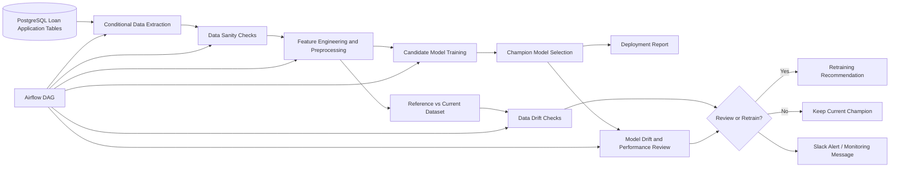
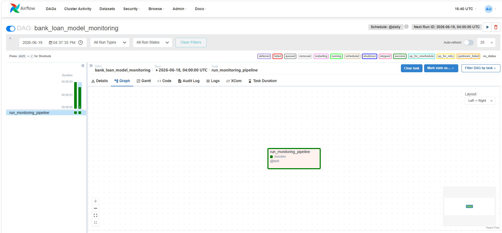
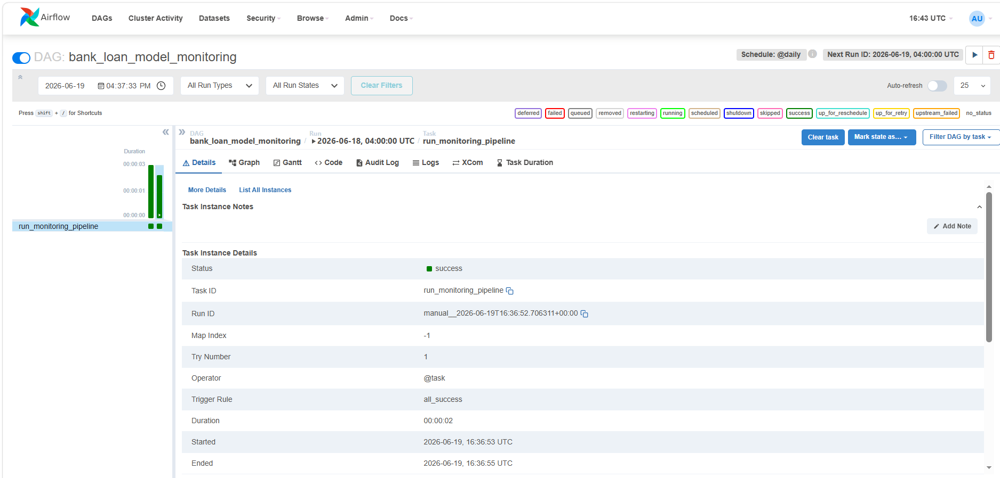
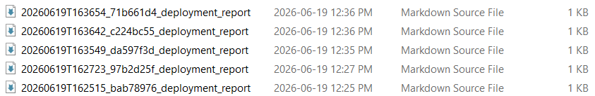
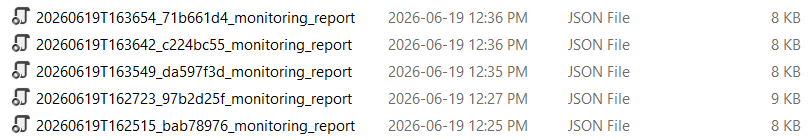

# Bank Loan Model Monitoring with Airflow and Docker

End-to-End Banking MLOps Pipeline for Loan Eligibility Model Monitoring, Drift Detection, Data Quality Checks, Deployment Reporting, and Airflow Orchestration

**Python · PostgreSQL · Apache Airflow · Docker · scikit-learn · Data Drift · Model Drift · MLOps · Banking Analytics · Model Governance**

---

## Executive Summary

This project develops an end-to-end MLOps monitoring workflow for a bank loan eligibility classification model. The goal is to simulate how a banking analytics, credit risk, or model monitoring team can track whether a deployed model remains reliable as new loan application data arrives.

The project goes beyond one-time model training. It builds a repeatable monitoring pipeline that extracts data from PostgreSQL, validates data quality, engineers model features, trains candidate models, selects a champion model, checks for data drift and model performance changes, generates deployment reports, and orchestrates the workflow using Apache Airflow and Docker.

The project is framed as a **model monitoring and analyst review workflow**, not as an automated loan approval or decline system. This distinction is important in financial services because lending models must be explainable, auditable, monitored, governed, and reviewed before they can support business decisions.

The workflow covers the full monitoring lifecycle:

* Banking business problem framing
* PostgreSQL data extraction
* Data quality and sanity checks
* Missing value handling
* Feature engineering
* Random Forest and Gradient Boosting model training
* Champion model selection
* Model deployment report generation
* Data drift monitoring
* Model drift and performance review
* Retraining recommendation logic
* Airflow DAG orchestration
* Dockerized local deployment
* Slack-style monitoring alerts
* Governance and responsible-use documentation

This project is designed to demonstrate practical readiness for Canadian banking, credit analytics, risk analytics, model monitoring, data science, and MLOps-related roles.

---

## Business Problem

A machine learning model can perform well during development but degrade silently after deployment. In banking, this can happen when borrower profiles change, credit conditions shift, product strategies evolve, underwriting policies change, or upstream data pipelines introduce new data patterns.

A useful banking model monitoring solution should not only generate predictions. It should help answer practical production questions:

* Is the new batch of loan application data complete and usable?
* Are required fields still arriving as expected?
* Has the distribution of borrower or credit attributes changed?
* Is the current data still similar to the reference training data?
* Has model performance degraded?
* Should the model remain deployed, be reviewed, or be retrained?
* What evidence should be documented for business, risk, and governance stakeholders?

This project connects machine learning, data engineering, monitoring, orchestration, reporting, and governance into one reproducible workflow.

---

## Project Objective

The objective of this project is to build a repeatable model monitoring pipeline that supports the following decision:

> Is the current loan eligibility model still reliable enough to remain in use, or should it be reviewed and retrained?

The pipeline produces:

* Data quality checks
* Model performance metrics
* Feature-level drift diagnostics
* Champion model selection report
* Deployment report
* Monitoring report
* Review or retraining recommendation
* Airflow-orchestrated execution flow

---

## Project Highlights

| Area                     | Result                                                                         |
| ------------------------ | ------------------------------------------------------------------------------ |
| Business use case        | Bank loan eligibility model monitoring                                         |
| Data source              | PostgreSQL loan application batches                                            |
| Local validation source  | Sample loan application CSV                                                    |
| Candidate models         | Random Forest and Gradient Boosting                                            |
| Monitoring checks        | Data sanity, data drift, model quality, retraining signal                      |
| Numeric drift methods    | PSI and Kolmogorov-Smirnov test                                                |
| Categorical drift method | Chi-square distribution test                                                   |
| Orchestration            | Apache Airflow DAG                                                             |
| Containerization         | Docker Compose with PostgreSQL and Airflow                                     |
| Reporting outputs        | Deployment report and drift monitoring report                                  |
| Alerting                 | Slack-style monitoring notification logic                                      |
| Governance decision      | Analyst review and retraining recommendation, not automated credit decisioning |

---

## Business Impact

This project converts a basic loan classification workflow into a monitored production-style process.

Instead of only asking:

> Which model has the best accuracy?

the project asks:

* Can the data be trusted?
* Has the data changed?
* Is the model still performing acceptably?
* Should the model be reviewed before continued use?
* Can the monitoring evidence be explained to business and governance stakeholders?

The monitoring pipeline supports a realistic banking workflow:

1. Extract the latest loan application batch.
2. Validate data completeness and structure.
3. Train or evaluate the current model.
4. Compare current data against the reference window.
5. Generate model and drift monitoring reports.
6. Recommend whether to keep, review, or retrain the model.
7. Document the outcome for governance review.

This makes the project more realistic than a simple model-training notebook because it focuses on the post-deployment responsibilities expected in financial services analytics.

---

## Architecture Diagram



---

## Example Output Screenshots

### Airflow DAG Graph



### Airflow Successful Run



### Model Deployment Report



### Drift Monitoring Report



---

## Key Insights

### 1. Model training is only the first step

A model that performs well on historical data can still become unreliable in production. Monitoring is needed to detect when current data no longer resembles the original training environment.

### 2. Data quality issues can create model risk

Missing values, duplicate records, row-count changes, schema changes, and unavailable target fields can affect model reliability. The project includes data sanity checks before modelling or monitoring decisions are made.

### 3. Drift monitoring supports earlier review

The pipeline compares reference and current data windows to identify feature-level changes. This helps analysts detect whether borrower profiles, application behaviour, or upstream data patterns have shifted.

### 4. Model monitoring should produce business-readable evidence

The project generates reports that explain model performance, drift findings, alert level, and retraining recommendation. This is important because monitoring results should support stakeholder review, not remain hidden inside code.

### 5. Orchestration makes the workflow repeatable

Airflow is used to organize extraction, validation, training, monitoring, reporting, and alerting into a repeatable pipeline. This reflects how monitoring workflows are scheduled and reviewed in real analytics environments.

### 6. Governance is part of the deliverable

The project includes responsible-use language, model documentation, monitoring logic, and restrictions against automated credit decisioning. This shows awareness of financial-services model risk expectations.

---

## Methodology

| Phase                 | Description                                                                                       |
| --------------------- | ------------------------------------------------------------------------------------------------- |
| Business framing      | Define the loan eligibility monitoring use case and responsible-use boundary                      |
| Data extraction       | Connect to PostgreSQL and retrieve loan application records                                       |
| Data validation       | Check required columns, missingness, duplicates, row count, and target availability               |
| Feature engineering   | Create banking-relevant model features such as credit utilization and debt-to-income style ratios |
| Model training        | Train Random Forest and Gradient Boosting candidate models                                        |
| Model evaluation      | Compare models using classification metrics and select a champion model                           |
| Deployment reporting  | Generate a report summarizing model performance and monitoring decision                           |
| Data drift monitoring | Compare reference and current data distributions using PSI, KS test, and chi-square checks        |
| Model monitoring      | Review model quality and determine whether retraining should be recommended                       |
| Orchestration         | Run the workflow through an Airflow DAG                                                           |
| Container deployment  | Use Docker Compose to run PostgreSQL and Airflow locally                                          |
| Alerting              | Send Slack-style notification when monitoring completes or review is required                     |

---

## Repository Structure

```text
bank-loan-model-monitoring-airflow-docker/
│
├── README.md
├── requirements.txt
├── pyproject.toml
├── docker-compose.yml
├── Makefile
├── .env.example
├── .gitignore
├── LICENSE
│
├── .github/
│   └── workflows/
│       └── ci.yml
│
├── airflow/
│   └── dags/
│       └── loan_monitoring_dag.py
│
├── config/
│   └── pipeline_config.yaml
│
├── data/
│   ├── sample/
│   │   └── loan_applications_sample.csv
│   ├── raw/
│   │   ├── loan_applications_2015_01_01_to_2015_05_31_reference.csv
│   │   └── loan_applications_2015_06_01_to_2015_12_31_monitoring.csv
│   └── processed/
│
├── database/
│   ├── 01_create_schema.sql
│   └── 02_monitoring_tables.sql
│
├── docs/
│   ├── assets/
│   │   ├── architecture.mmd
│   │   ├── architecture.png
│   │   ├── airflow_dag_graph.png
│   │   ├── airflow_grid_success.png
│   │   ├── model_deployment_report.png
│   │   └── drift_monitoring_report.png
│   ├── architecture.md
│   ├── data_dictionary.md
│   ├── methodology.md
│   ├── model_card.md
│   ├── runbook.md
│   ├── recruiter_review_notes.md
│   ├── example_deployment_report.md
│   └── example_monitoring_summary.json
│
├── notebooks/
│   ├── 00_architecture_and_business_context.ipynb
│   ├── 01_data_understanding_and_extraction.ipynb
│   ├── 02_eda_and_data_quality.ipynb
│   ├── 03_preprocessing_feature_engineering.ipynb
│   ├── 04_model_training_and_evaluation.ipynb
│   ├── 05_deployment_report.ipynb
│   ├── 06_drift_monitoring_reports.ipynb
│   └── 07_airflow_docker_orchestration.ipynb
│
├── scripts/
│   ├── load_sample_to_postgres.py
│   └── run_local_monitoring.py
│
├── src/
│   └── ml_monitoring/
│       ├── alerts/
│       │   └── slack.py
│       ├── data/
│       │   ├── extract.py
│       │   ├── load_sample_to_postgres.py
│       │   └── sanity.py
│       ├── features/
│       │   └── preprocessing.py
│       ├── models/
│       │   ├── evaluate.py
│       │   └── train.py
│       ├── monitoring/
│       │   └── drift.py
│       ├── pipelines/
│       │   └── batch_monitoring.py
│       ├── reports/
│       │   └── reporting.py
│       ├── config.py
│       └── database.py
│
├── tests/
│   ├── test_monitoring.py
│   ├── test_preprocessing.py
│   └── test_sanity.py
│
├── models/
│   └── .gitkeep
│
└── reports/
    ├── drift/
    └── model/
```

---

## Notebook Workflow

| Notebook                                     | Purpose                                                                                    |
| -------------------------------------------- | ------------------------------------------------------------------------------------------ |
| `00_architecture_and_business_context.ipynb` | Defines business context, architecture, monitoring objective, and responsible-use boundary |
| `01_data_understanding_and_extraction.ipynb` | Reviews data schema, extraction logic, target distribution, and source assumptions         |
| `02_eda_and_data_quality.ipynb`              | Performs EDA, missingness checks, duplicate checks, and data sanity review                 |
| `03_preprocessing_feature_engineering.ipynb` | Builds preprocessing and feature engineering workflow                                      |
| `04_model_training_and_evaluation.ipynb`     | Trains and evaluates Random Forest and Gradient Boosting models                            |
| `05_deployment_report.ipynb`                 | Documents champion model performance and deployment-readiness output                       |
| `06_drift_monitoring_reports.ipynb`          | Generates data drift checks and retraining recommendation logic                            |
| `07_airflow_docker_orchestration.ipynb`      | Explains Docker, PostgreSQL, Airflow DAG execution, and alerting workflow                  |

---

## Technical Stack

| Category         | Tools                                                     |
| ---------------- | --------------------------------------------------------- |
| Programming      | Python                                                    |
| Data analysis    | pandas, NumPy, SciPy                                      |
| Machine learning | scikit-learn                                              |
| Database         | PostgreSQL                                                |
| Database access  | SQLAlchemy, psycopg2                                      |
| Orchestration    | Apache Airflow                                            |
| Containerization | Docker, Docker Compose                                    |
| Monitoring       | PSI, KS test, chi-square drift checks, data sanity checks |
| Reporting        | Markdown and JSON monitoring reports                      |
| Alerting         | Slack webhook-style alert logic                           |
| Testing          | pytest                                                    |
| CI/CD            | GitHub Actions                                            |
| Version control  | Git, GitHub                                               |

---

## Models Evaluated

The project evaluates two candidate classification models:

* Random Forest Classifier
* Gradient Boosting Classifier

Model comparison uses metrics more appropriate than accuracy alone:

* ROC-AUC
* Precision
* Recall
* F1 score
* Balanced accuracy
* Accuracy

The selected champion model is written to the `models/` directory during local execution.

---

## Monitoring Logic

| Monitoring layer       | What it checks                                                            | Output                        |
| ---------------------- | ------------------------------------------------------------------------- | ----------------------------- |
| Data sanity            | Missingness, duplicates, row count, required columns, target availability | Pass/fail quality gate        |
| Numeric data drift     | PSI and KS test across reference vs current windows                       | Feature-level drift report    |
| Categorical data drift | Chi-square distribution change test                                       | Feature-level drift report    |
| Model quality          | ROC-AUC, precision, recall, F1, balanced accuracy                         | Champion model report         |
| Deployment decision    | Drift summary and model metrics                                           | Review/retrain recommendation |

---

## Example Monitoring Output

After a monitoring run, the pipeline writes a deployment report similar to:

```text
# Model Deployment and Monitoring Report

## Champion Model
- Selected model: gradient_boosting
- ROC-AUC: 0.xxxx
- F1: 0.xxxx
- Precision: 0.xxxx
- Recall: 0.xxxx

## Monitoring Decision
- Drift alert level: pass/warn/fail
- Failed features: n
- Warning features: n
- Retrain recommended: true/false
```

The exact metrics depend on the data window and sample used.

Generated outputs are saved under:

```text
models/
reports/model/
reports/drift/
```

---

## Local Setup and Execution

This project can be run in two ways:

1. **Locally without Docker** to validate the Python ML monitoring pipeline.
2. **With Docker, PostgreSQL, and Airflow** to run the full orchestration workflow.

---

## 1. Run Locally Without Docker

Use this option first to confirm that the Python package, tests, model training, and monitoring pipeline work correctly.

Open PowerShell or the VS Code terminal from the project root:

```powershell
cd "D:\Banking and Finance\Projects\bank-loan-model-monitoring-airflow-docker"
```

Create a virtual environment:

```powershell
python -m venv .venv
```

Activate the virtual environment:

```powershell
.\.venv\Scripts\activate
```

Upgrade pip:

```powershell
python -m pip install --upgrade pip
```

Install the project with development dependencies:

```powershell
pip install -e ".[dev]"
```

Run the test suite:

```powershell
pytest
```

Expected result:

```text
5 passed
```

Run the local monitoring pipeline using the sample dataset:

```powershell
python scripts/run_local_monitoring.py --config config/pipeline_config.yaml --source sample
```

After the pipeline runs successfully, check:

```text
models/
reports/model/
reports/drift/
```

Expected generated outputs include:

```text
models/champion_model.joblib
reports/model/..._deployment_report.md
reports/drift/..._monitoring_report.json
```

This confirms that the ML training, evaluation, and monitoring pipeline works without PostgreSQL, Docker, or Airflow.

---

## 2. Run With Docker, PostgreSQL, and Airflow

Use this option after the local Python workflow works successfully.

Make sure Docker Desktop is open and running.

From the project root:

```powershell
cd "D:\Banking and Finance\Projects\bank-loan-model-monitoring-airflow-docker"
```

Create the environment file if it does not already exist:

```powershell
if (!(Test-Path .env)) { Copy-Item .env.example .env }
```

Start the Docker stack:

```powershell
docker compose up -d --build
```

Check that the containers are running:

```powershell
docker compose ps
```

You should see services similar to:

```text
postgres
airflow-db
airflow-webserver
airflow-scheduler
```

Open Airflow in your browser:

```text
http://localhost:8080
```

Login credentials:

```text
username: admin
password: admin
```

---

## 3. Load Sample Data Into PostgreSQL

After Docker containers are running, load the sample loan application data into PostgreSQL:

```powershell
docker compose exec -w /opt/airflow/project airflow-scheduler python scripts/load_sample_to_postgres.py
```

Expected output:

```text
Loaded ... rows into loan_applications.
```

---

## 4. Run the PostgreSQL Monitoring Pipeline Manually

After the sample data is loaded into PostgreSQL, run the monitoring pipeline from inside the Airflow container:

```powershell
docker compose exec -w /opt/airflow/project airflow-scheduler python scripts/run_local_monitoring.py --config config/pipeline_config.yaml --source postgres
```

This command runs the full monitoring workflow using PostgreSQL as the data source.

After the run completes, check:

```text
models/
reports/model/
reports/drift/
```

---

## 5. Run the Pipeline Through Airflow

Open Airflow:

```text
http://localhost:8080
```

Go to the DAGs page and find:

```text
bank_loan_model_monitoring
```

Turn the DAG toggle on.

Click the play button:

```text
▶ Trigger DAG
```

After the DAG finishes, check the generated outputs:

```text
models/
reports/model/
reports/drift/
```

---

## Full Workflow From Scratch

Use the following sequence to run the complete project from a fresh setup:

```powershell
cd "D:\Banking and Finance\Projects\bank-loan-model-monitoring-airflow-docker"

python -m venv .venv
.\.venv\Scripts\activate
python -m pip install --upgrade pip
pip install -e ".[dev]"

pytest

python scripts/run_local_monitoring.py --config config/pipeline_config.yaml --source sample

if (!(Test-Path .env)) { Copy-Item .env.example .env }

docker compose up -d --build
docker compose ps

docker compose exec -w /opt/airflow/project airflow-scheduler python scripts/load_sample_to_postgres.py

docker compose exec -w /opt/airflow/project airflow-scheduler python scripts/run_local_monitoring.py --config config/pipeline_config.yaml --source postgres
```

Then trigger the DAG from the Airflow UI:

```text
http://localhost:8080
DAG: bank_loan_model_monitoring
Click ▶ Trigger DAG
```

---

## Docker Troubleshooting

### Docker image pull fails with EOF

If Docker fails while pulling `postgres:15` or `apache/airflow`, retry the image pull manually:

```powershell
docker pull postgres:15
docker pull apache/airflow:2.9.3-python3.10
```

If downloads continue to fail, restart Docker Desktop and retry.

### Airflow does not open on localhost

Check containers:

```powershell
docker compose ps
```

Check Airflow logs:

```powershell
docker compose logs -f airflow-webserver
```

Airflow can take 1 to 3 minutes to become available after startup.

### PostgreSQL data load fails because config is not found

Use the corrected command with the working directory flag:

```powershell
docker compose exec -w /opt/airflow/project airflow-scheduler python scripts/load_sample_to_postgres.py
```

---

## Stopping and Restarting the Project

When the work is finished, stop the containers safely:

```powershell
docker compose stop
```

To start the containers again later:

```powershell
docker compose start
```

To remove the containers while keeping named volumes:

```powershell
docker compose down
```

Avoid using the following command unless you intentionally want to delete database volumes:

```powershell
docker compose down -v
```

---

## Data Notes

For local testing, the project uses:

```text
data/sample/loan_applications_sample.csv
```

Raw production data, credentials, generated datasets, and trained model binaries should not be committed to a public GitHub repository.

---

## What Not to Commit

Do not commit raw confidential data, processed datasets, model binaries, local environment folders, credentials, or generated database volumes.

Recommended `.gitignore` coverage:

```gitignore
.env
.venv/
__pycache__/
.ipynb_checkpoints/
.pytest_cache/

data/processed/*
models/*.joblib
models/*.pkl
reports/model/*
reports/drift/*

*.db
*.sqlite
*.log
```

Sample data and non-sensitive example reports may be committed if they are safe for public portfolio use.

---

## Governance and Responsible Use

This project is built for decision support and model monitoring.

It does not claim to automate real lending approvals or declines. In a real banking environment, a similar workflow would require:

* Independent model validation
* Fairness and bias testing
* Adverse-action reason-code review
* Privacy and access controls
* Data lineage documentation
* Production monitoring thresholds
* Human review and sign-off
* Regulatory and compliance approval

The intended use is to support analyst review, model monitoring, and retraining decisions.

The model should not be used as an automated credit decisioning system.

---

## Why This Project Is Credible

The project is intentionally designed as a monitoring and governance workflow rather than a high-accuracy modelling demo.

In real financial services projects, unusually high model performance can be a warning sign of leakage, target contamination, or unrealistic evaluation design. This project focuses on practical production-readiness signals:

* Configuration-driven workflow
* Train/test evaluation
* Champion model selection
* Data quality gates
* Drift checks across reference and current data windows
* Monitoring reports
* Retraining recommendation logic
* Airflow orchestration
* Dockerized reproducibility
* Responsible-use limitations

A monitored, explainable, and repeatable workflow is more valuable for banking analytics than a one-time notebook that only reports accuracy.

---

## Target Roles This Project Supports

| Target role                       | Project evidence                                                                             |
| --------------------------------- | -------------------------------------------------------------------------------------------- |
| Data Scientist, Banking Analytics | Classification modelling, model evaluation, monitoring reports, retraining recommendation    |
| Risk Analytics Analyst            | Data quality checks, drift monitoring, model performance review, governance documentation    |
| Credit Risk Analyst               | Loan eligibility context, borrower-level features, monitoring logic, responsible-use framing |
| Model Monitoring Analyst          | Data drift checks, model drift review, alerting, monitoring reports                          |
| Model Risk Analyst                | Model card, deployment report, governance limitations, monitoring controls                   |
| Data Analyst, Financial Services  | SQL extraction, data validation, reporting outputs, business-focused README                  |
| MLOps / ML Platform Analyst       | Airflow DAG, Docker Compose, configuration-driven pipeline, reproducible execution           |
| BI / Reporting Analyst            | Stakeholder-ready reports, monitoring summaries, KPI-style outputs                           |

---

## Limitations

* The sample dataset is used for portfolio demonstration and does not represent a production Canadian bank system.
* The model is intended for monitoring and analyst review, not automated loan approval or decline.
* Drift thresholds are configurable demonstration thresholds and should be validated before production use.
* Business rules, fairness controls, and governance thresholds would need review by risk, legal, compliance, and model validation teams.
* Production implementation would require secure infrastructure, secrets management, monitoring dashboards, access controls, and independent validation.

---

## Summary

This project demonstrates the ability to build a finance-focused ML monitoring workflow beyond basic modelling.

It shows practical experience with:

* Banking analytics business context
* Python-based machine learning
* SQL and PostgreSQL extraction
* Data quality validation
* Feature engineering
* Random Forest and Gradient Boosting models
* Model evaluation and champion selection
* Data drift and model monitoring
* Deployment report generation
* Airflow DAG orchestration
* Dockerized local deployment
* Slack-style alerting
* Governance and responsible-use documentation
* GitHub-ready project organization

The project is built to demonstrate readiness for Canadian banking, credit analytics, risk analytics, model monitoring, financial data science, and MLOps-related roles.
model-governance
```
