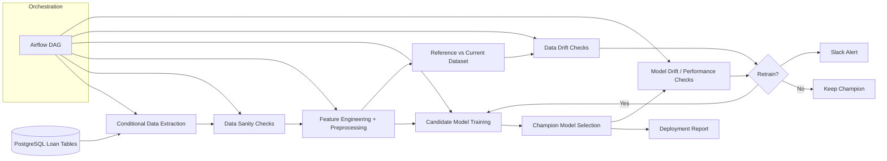

# Architecture Diagram

The architecture is designed around a controlled monitoring workflow: data is extracted from PostgreSQL by date window, checked for sanity, transformed using a reusable scikit-learn preprocessing pipeline, trained against candidate models, and monitored against a reference window for feature drift and retraining signals.
